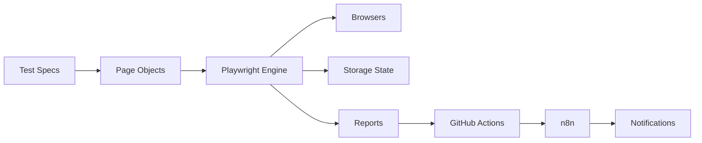

# 🚀 Sauce Demo Automation Framework

<p align="center">
  <b>Production-Ready Test Automation Framework using Playwright, CI/CD & n8n</b>
</p>

<p align="center">
  
  
  
  
  
</p>

<p align="center">
  <a href="https://github.com/pravin234/sauce-demo-automation-framework/actions/workflows/playwright-tests.yml">
    
  </a>
  <a href="https://github.com/pravin234/sauce-demo-automation-framework/actions/workflows/pr-validation.yml">
    
  </a>
  <a href="https://github.com/pravin234/sauce-demo-automation-framework/actions/workflows/n8n-integration.yml">
    
  </a>
</p>

---

## 📌 Overview

A **scalable, enterprise-grade test automation framework** built for the SauceDemo application using:

* ⚡ **Playwright + TypeScript**
* 🔄 **CI/CD with GitHub Actions**
* 🔔 **Workflow automation using n8n**
* 🐳 **Dockerized execution**

---

## 💼 Why This Project Stands Out

This project demonstrates **real-world SDET/QA Automation skills**:

* ✔️ Framework design using Page Object Model
* ✔️ Cross-browser & parallel execution strategy
* ✔️ CI/CD pipeline implementation
* ✔️ Reporting & analytics integration
* ✔️ Workflow automation (Slack, Jira, Email)
* ✔️ Scalable and maintainable architecture

---

## 🧠 Architecture Overview



---

## ✨ Features

* ✅ 15 End-to-End Tests
* 🧩 Page Object Model (POM)
* ⚡ Parallel Execution
* 🌍 Cross-Browser Testing (Chromium, Firefox, WebKit)
* 🔐 Storage State (Session reuse)
* 🔄 CI/CD Pipelines (GitHub Actions)
* 📊 Playwright + Allure Reporting
* 🐳 Docker Support
* 🤖 Flaky Test Detection
* 📱 Mobile Testing Support

---

## 🧪 Test Coverage

### 🔹 Functional Tests

* Login (valid & invalid)
* Product browsing
* Cart management
* Checkout workflow
* Price validation

### 🔹 Advanced Scenarios

* Multi-user testing
* Storage state reuse
* Parallel execution
* Context isolation

---

## 🏗️ Project Structure

```
📦 sauce-demo-automation-framework
├── tests/
│   ├── page-objects/
│   ├── specs/
│   └── utils/
├── .github/workflows/
├── docs/
├── n8n/
├── dashboard/
├── playwright.config.ts
└── package.json
```

---

## 🚀 Quick Start

### 🔧 Prerequisites

* Node.js 18+
* Git

---

### 📥 Installation

```bash
git clone https://github.com/pravin234/sauce-demo-automation-framework.git
cd sauce-demo-automation-framework

npm install
npx playwright install
```

---

## ▶️ Running Tests

```bash
npm run test           # Run all tests
npm run test:headed    # Run in UI mode
npm run test:report    # Open HTML report
```

---

## 📊 Reporting

### 🔹 Playwright Report

```bash
npm run test:report
```

### 🔹 Allure Report

```bash
npx playwright test
npx allure generate ./allure-results --clean
npx allure open
```

---

## 🌐 Live Reports (GitHub Pages)

👉 Add your deployed link:

```
https://<your-username>.github.io/sauce-demo-automation-framework/
```

---

## 🔄 CI/CD Pipeline

### GitHub Actions Features:

* ✅ Matrix Testing (Node 18/20 + Browsers)
* ✅ PR Validation
* ✅ Parallel Execution
* ✅ Report Publishing
* ✅ n8n Webhook Integration

---

## 🔗 n8n Integration

Automated workflows:

* 🔔 Slack Notifications
* 🎫 Jira Ticket Creation
* 📧 Email Reports
* 💬 Discord Alerts
* 📊 Test Analytics

---

## 🐳 Docker Support

```bash
docker build -t sauce-demo-tests .
docker run sauce-demo-tests
```

---

## 📱 Mobile Testing

Supports device emulation:

* Pixel 5
* iPhone devices

---

## ☁️ Cloud Execution

Supports:

* BrowserStack
* Sauce Labs

---

## 📈 Dashboard

Basic analytics dashboard included:

```
dashboard/index.html
```

---

## 🛠️ Tech Stack

* Playwright
* TypeScript
* Node.js
* GitHub Actions
* n8n
* Docker
* Allure

---

## 💡 Future Enhancements

* 📊 Allure Dashboard Hosting
* 🤖 AI Test Generation
* 🧬 Self-healing locators
* 📈 Advanced analytics (Grafana)

---

## 🤝 Contributing

```bash
git checkout -b feature/new-feature
git commit -m "Add feature"
git push origin feature/new-feature
```

---

## 📄 License

MIT License

---

## 🙌 Acknowledgments

* SauceDemo
* Playwright
* n8n
* GitHub Actions

---


---


Just tell me 👍
